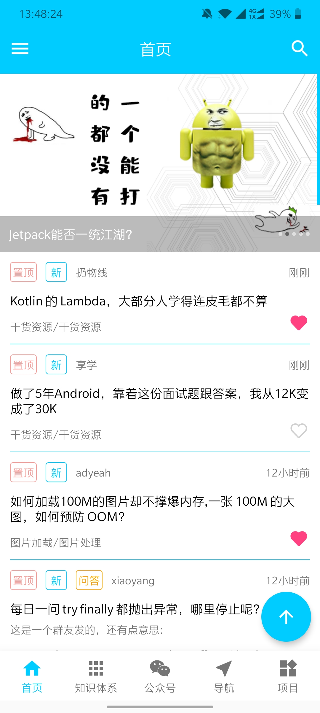
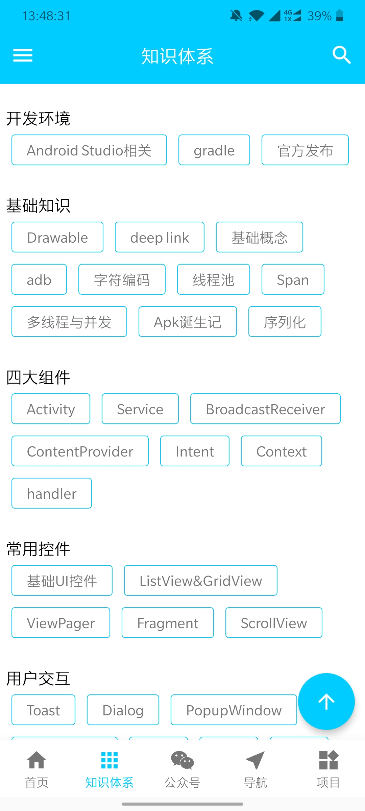
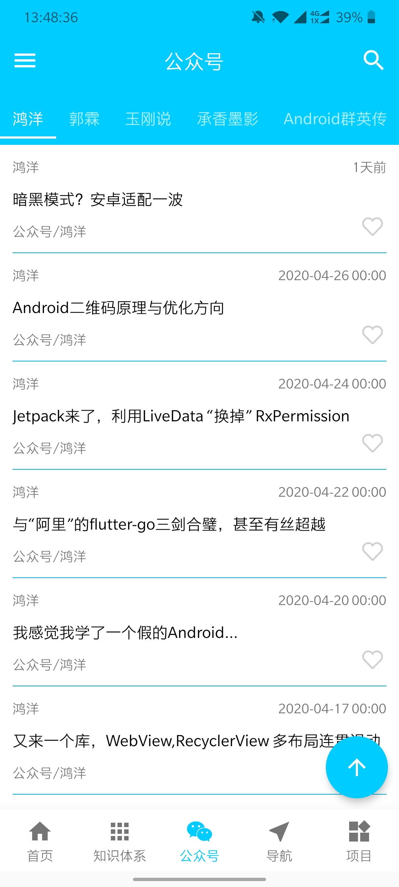
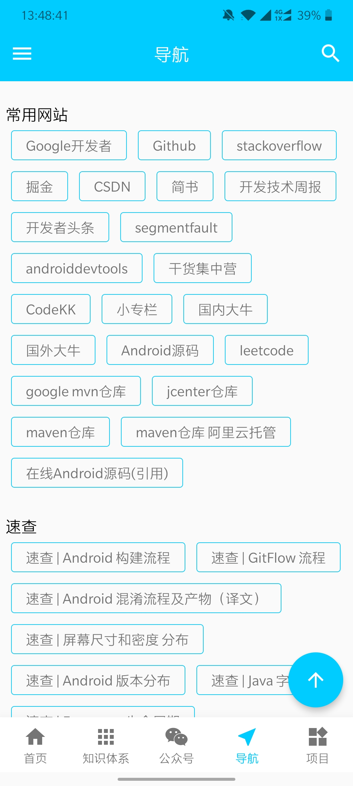
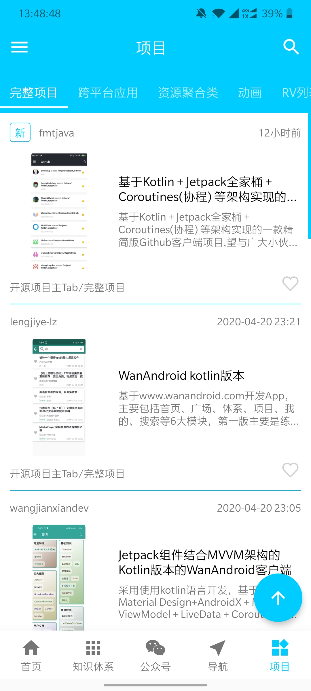
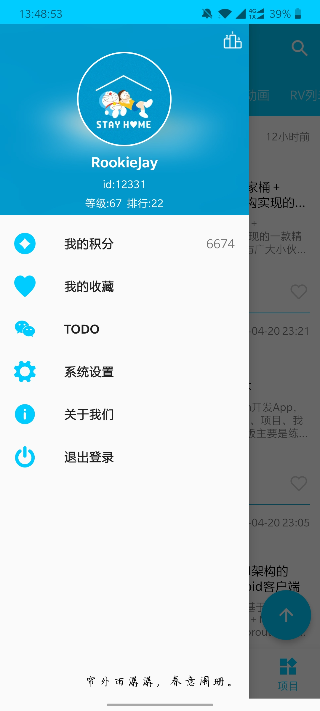
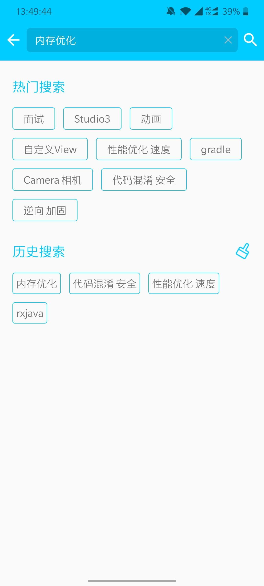
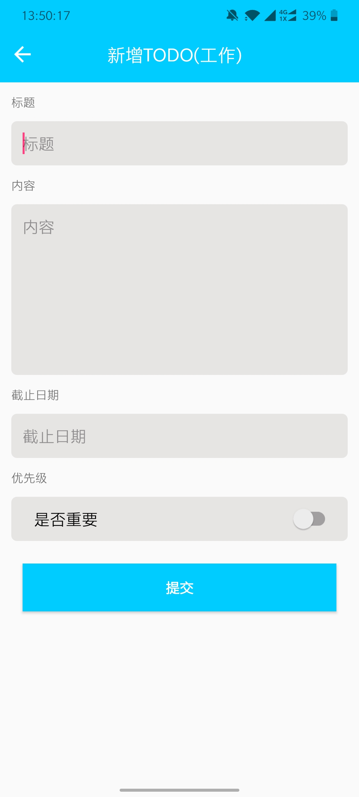
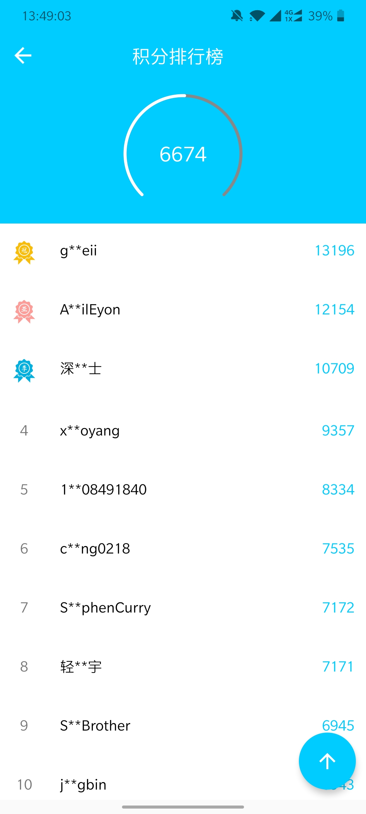

# JWanandroid

## 介绍
Java版Wanandroid客户端，主体使用MVPArms，利用 MVP + RxJava + Retrofit + Glide + EventBus等框架开发。

*注：由于本人水平所限，目前可能还存在一些bug，只能在bugly上看到会处理，有发现的小伙伴希望能多提[issue](https://github.com/RookieJay/JWanandroid/issues/new)说明下复现步骤，谢谢。*

## 界面截图

|  |  |  |  |
| --- | --- | --- | --- |
|  |  |  |  |
| --- | --- | --- | --- |
|  |  |  |  |

## 体验apk:

- [蒲公英下载](https://www.pgyer.com/oRsT)
- [github下载](https://github.com/RookieJay/JWanandroid/raw/master/apk/wanandroid-release-v1.1.0.apk)

## 开放API

感谢无私的[wanandroid](https://wanandroid.com/)站长[鸿洋](https://me.csdn.net/lmj623565791)提供的[开放API](https://wanandroid.com/blog/show/2)

## 主要功能

- 文章：首页、问答、公众号、知识体系、导航、项目、广场
- 搜索：热门搜索、搜索历史
- 积分：我的积分、积分排行榜
- 分享：我的分享、文章分享
- 收藏：收藏/取消收藏文章、我的收藏
- TODO：待办、已办
- 置顶：各个文章列表点击按钮置顶、底部导航再次点击置顶
- 设置：暗黑模式、列表动画、检查更新
- 个人：登录、头像本地设置及背景模糊

## 开源框架

- [JessYanCoding/MVPArms](https://github.com/JessYanCoding/MVPArms)
- [square/dagger](https://github.com/square/dagger)
- [ReactiveX/RxJava](https://github.com/ReactiveX/RxJava)
- [square/retrofit](https://github.com/square/retrofit)
- [tbruyelle/RxPermissions](https://github.com/tbruyelle/RxPermissions)
- [bumptech/glide](https://github.com/bumptech/glide)
- [scwang90/SmartRefreshLayout](https://github.com/scwang90/SmartRefreshLayout)
- [youth5201314/banner](https://github.com/youth5201314/banner)
- [CymChad/BaseRecyclerViewAdapterHelper](https://github.com/CymChad/BaseRecyclerViewAdapterHelper)
- [goweii/AnyLayer](https://github.com/goweii/AnyLayer)
- [H07000223/FlycoTabLayout](https://github.com/H07000223/FlycoTabLayout)
- [jd-alexander/LikeButton](https://github.com/jd-alexander/LikeButton)
- [Kennyc1012/MultiStateView](https://github.com/Kennyc1012/MultiStateView)

## 更新日志

### 1.1.2(4)
- 【修复】修改框架中ButterKnife的解绑顺序到RxLifeCycle之后(转移到onDestroy())，以解决多个界面快速退出时的控件空指针问题
- 【修复】bugly上的一些问题
- 【优化】头像功能，判断是否具有外部储存，适配Android 7.0及以上

### 1.1.1(3)
- 【修复】没有在local.properties配置keystore信息无法运行app的问题
- 【修复】适配23以下获取颜色api
- 【修复】rv滑到底部快速打开其他activity，再返回加载更多视图不消失的问题
- 【修复】bugly上的一些问题
- 【优化】对一些细节进行补充优化

### 1.1.0(2)
- 适配Android Q 以下暗黑模式(手动开关)
- 优化主界面及tab界面pagerAdapter
- 配置改变时(横竖屏切换及昼夜模式改变)自定义逻辑，不执行系统默认重建
- 新增/优化个人用户界面MD风格
- 新增状态布局[MultiStateView](https://github.com/Kennyc1012/MultiStateView)
- 新增分享、问答等功能
- Application延迟加载第三方库，提高冷启动速度
- 优化UI布局、fix bugs
- 集成今日诗词，全局刷新header展示

### 1.0.0(1)
- 第一版，基本包含[wanandroid开放API](https://wanandroid.com/blog/show/2)所有功能

